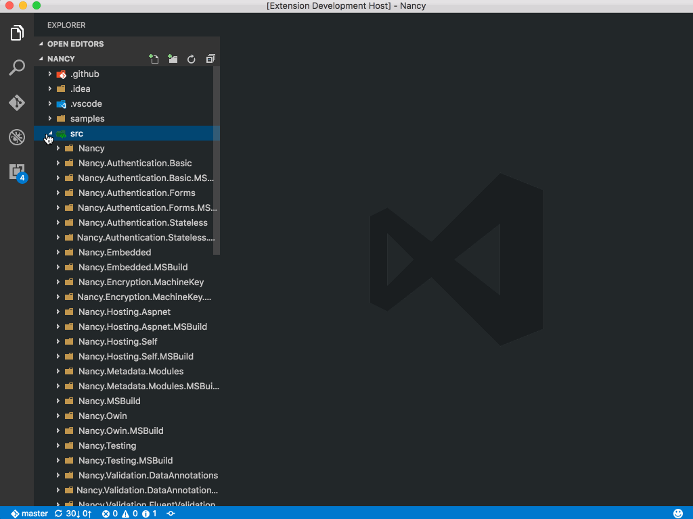
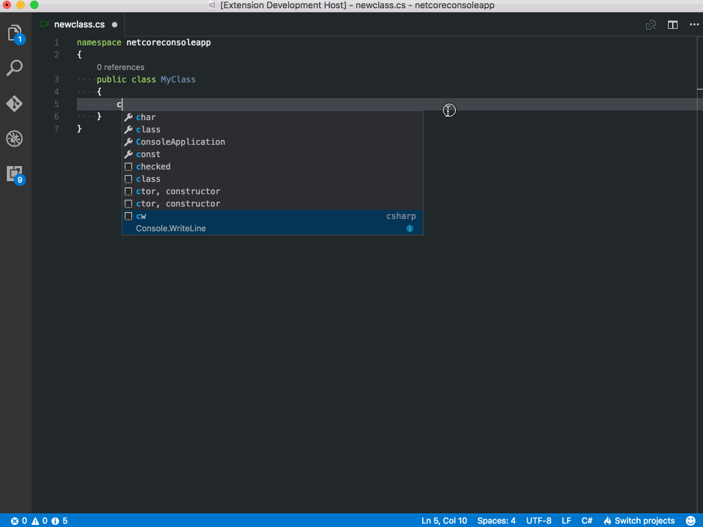
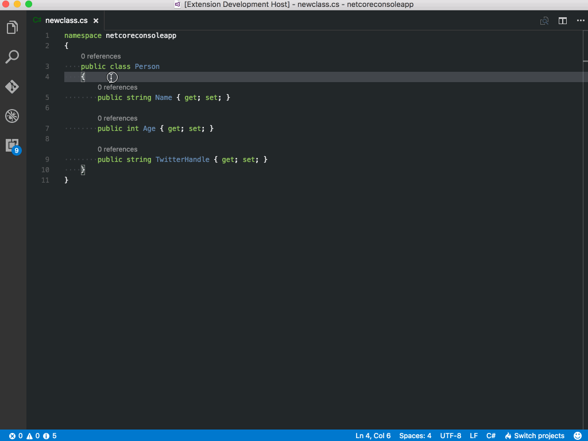
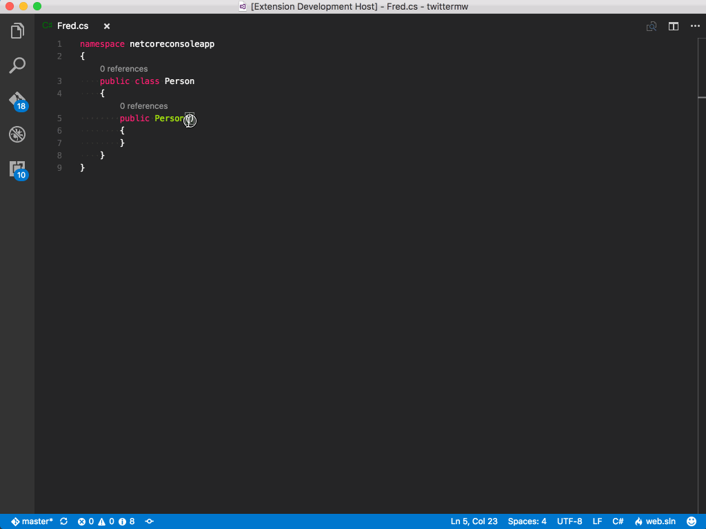

# C# Extensions

Welcome to C# Extensions.  This VSCode extension provides extensions to the IDE that will hopefully speed up your development workflow.

## Features

**Add C# Class**

**Add C# Interface**

**Add fields from constructors**

**Add constructor from properties**

**Add read-only property from constructors**

**Add property from constructors**

This extension traverses up the folder tree to find the project.json or *.csproj and uses that as the parent folder to determine namspaces.

-----------------------------------------------------------------------------------------------------------

## Licence 

MIT  

See [licence.txt](./licence.txt)
